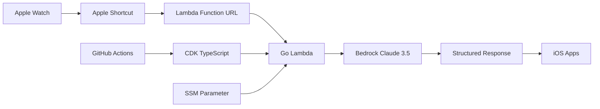

# Wrist Agent

A seamless Apple Watch to AWS Bedrock integration system that enables one-tap voice capture, intelligent processing through Claude 3.5 Sonnet, and automatic creation of Notes, Reminders, or Calendar events.

## 🚀 Quick Start

1. **[Deploy Infrastructure](docs/docs/setup.md)** - AWS CDK deployment to us-west-2
2. **[Configure Security](docs/docs/security.md)** - Set up authentication tokens
3. **[Install Shortcut](docs/docs/apple-shortcut.md)** - Add to Apple Watch

## ✨ Key Features

- **🎙️ One-Tap Voice Capture**: Direct from Apple Watch with complication support
- **🧠 AI Processing**: Claude 3.5 Sonnet with optional extended thinking (up to 65K thinking tokens)
- **📱 Native Integration**: Seamlessly creates Notes, Reminders, and Calendar events
- **🔒 Secure**: Header-based authentication with SSM Parameter Store
- **💰 Cost-Optimized**: Lambda Function URLs instead of API Gateway (~$15-31/month)
- **⚡ Fast**: ARM64 Lambda with sub-second response times
- **🚀 CI/CD Ready**: GitHub Actions with OIDC deployment

## 🏗️ Architecture



**Components:**

- **Apple Watch + Shortcuts**: Voice capture and iOS app integration
- **AWS Lambda**: Go 1.22+ runtime with Function URLs (ARM64)
- **AWS Bedrock**: Claude 3.5 Sonnet with Messages API
- **CDK v2**: TypeScript infrastructure as code
- **GitHub Actions**: OIDC-based CI/CD pipeline
- **Docusaurus**: Dual documentation (human + agent guides)

## 🎯 Use Cases

### 📝 Note Taking

Convert voice recordings into well-formatted notes with titles and tags.

### ⏰ Reminders

Create time-based reminders with automatic date/time extraction.

### 📅 Calendar Events

Schedule events with intelligent date/time parsing.

### 🔍 Research Mode

Get detailed, well-researched responses with sources.

### 🤔 Deep Thinking

Enable extended reasoning with up to 65K thinking tokens for complex queries.

## 🛠️ Technology Stack

### AWS Infrastructure

- **Lambda**: Go 1.22+ with provided.al2 runtime
- **Function URLs**: Direct HTTPS endpoints with CORS
- **Bedrock**: Claude 3.5 Sonnet (anthropic.claude-3-5-sonnet-20241022-v2:0)
- **SSM Parameter Store**: Secure token management
- **IAM**: Least privilege access control

### Development Tools

- **CDK v2**: TypeScript infrastructure
- **Go**: Lambda runtime with AWS SDK v2
- **GitHub Actions**: OIDC deployment
- **Docusaurus**: Documentation site

### Apple Integration

- **Shortcuts**: Custom shortcut with Watch complication
- **Voice Recognition**: Native iOS dictation
- **App Integration**: Notes, Reminders, Calendar

## 📋 Prerequisites

- AWS Account with Bedrock access
- AWS CLI configured
- Node.js 18+ and npm
- Go 1.22+
- Apple Developer Account (free tier sufficient)
- Apple Watch with watchOS 6+

## 🔧 Installation

### 1. Clone Repository

```bash
git clone https://github.com/your-username/wrist-agent.git
cd wrist-agent
```

### 2. Deploy Infrastructure

```bash
# Install CDK dependencies
cd cdk && npm install

# Install Go dependencies
cd ../lambda && go mod tidy

# Deploy to AWS
cd ../cdk
npx cdk bootstrap  # First time only
npx cdk deploy
```

### 3. Configure Security

```bash
# Generate secure token
TOKEN=$(openssl rand -base64 32)

# Update SSM parameter
aws ssm put-parameter \
  --name "/wrist-agent/client-token" \
  --value "$TOKEN" \
  --type "String" \
  --overwrite

echo "Your token: $TOKEN"
```

### 4. Setup Apple Shortcut

1. Get Function URL from CDK output
2. Create Apple Shortcut with HTTP POST action
3. Configure headers: `X-Client-Token` and `Content-Type: application/json`
4. Add Watch complication

**Full setup guide: [docs/docs/setup.md](docs/docs/setup.md)**

## 🧪 Testing

### Test the Lambda

```bash
# Get your configuration
FUNCTION_URL=$(aws cloudformation describe-stacks \
  --stack-name WristAgentStack \
  --query 'Stacks[0].Outputs[?OutputKey==`FunctionUrl`].OutputValue' \
  --output text)

TOKEN=$(aws ssm get-parameter \
  --name "/wrist-agent/client-token" \
  --with-decryption \
  --query 'Parameter.Value' \
  --output text)

# Test API
curl -X POST "$FUNCTION_URL" \
  -H "Content-Type: application/json" \
  -H "X-Client-Token: $TOKEN" \
  -d '{"text": "Create a note about testing", "mode": "note"}'
```

### Run Unit Tests

```bash
# Go Lambda tests
cd lambda && go test -v

# CDK tests
cd ../cdk && npm test
```

## 📊 Request/Response Format

### Request

```json
{
  "text": "Create a reminder to call John tomorrow at 2pm",
  "mode": "reminder",
  "maxTokens": 800,
  "thinkingTokens": 0
}
```

### Response

```json
{
  "markdown": "# Call John\n\nReminder to call John tomorrow at 2pm",
  "action": "reminder",
  "title": "Call John",
  "dueISO": "2025-01-16T14:00:00Z",
  "tags": ["reminder", "call"]
}
```

## 🔒 Security

- **Authentication**: Shared token in SSM Parameter Store
- **Transport**: HTTPS with TLS 1.2+
- **IAM**: Least privilege permissions
- **CORS**: Restrictive configuration for Apple Shortcuts
- **No persistent storage**: Stateless Lambda execution

**Security guide: [docs/docs/security.md](docs/docs/security.md)**

## 💰 Cost Estimation

Monthly costs for moderate usage (100 requests/day):

| Service            | Cost              |
| ------------------ | ----------------- |
| Lambda Invocations | ~$0.50            |
| Bedrock Claude 3.5 | ~$15-30           |
| SSM Parameter      | ~$0.05            |
| **Total**          | **~$15-31/month** |

## 📚 Documentation

- **[Getting Started](docs/docs/setup.md)** - Complete setup guide
- **[Apple Shortcut](docs/docs/apple-shortcut.md)** - iOS integration
- **[Security](docs/docs/security.md)** - Authentication and best practices
- **[Agent Guide](docs/docs/agent-guide.md)** - Implementation details for AI agents
- **[API Reference](docs/docs/api.md)** - Complete API documentation

## 🤝 Contributing

1. Fork the repository
2. Create a feature branch: `git checkout -b feature-name`
3. Make your changes and test thoroughly
4. Submit a pull request

See [CONTRIBUTING.md](CONTRIBUTING.md) for detailed guidelines.

## 🔄 CI/CD

GitHub Actions automatically:

- **Tests**: Run Go and CDK tests on PRs
- **Deploys**: Deploy infrastructure on main branch pushes
- **Security**: Scan for vulnerabilities with Trivy
- **Documentation**: Deploy docs to GitHub Pages

Uses OIDC for secure AWS deployment (no long-lived credentials).

## 🐛 Troubleshooting

### Common Issues

**401 Unauthorized**

- Verify token matches SSM parameter
- Check header name is `X-Client-Token`

**Bedrock Access Denied**

- Enable Claude 3.5 Sonnet in Bedrock console
- Verify IAM permissions

**CDK Deployment Fails**

- Ensure CDK is bootstrapped: `npx cdk bootstrap`
- Check AWS credentials and permissions

**More help: [docs/docs/troubleshooting.md](docs/docs/troubleshooting.md)**

## 📄 License

MIT License - see [LICENSE](LICENSE) file for details.

## 🙏 Acknowledgments

- **AWS CDK Team** - Infrastructure as code framework
- **Anthropic** - Claude 3.5 Sonnet language model
- **Apple** - Shortcuts and Watch integration
- **Go Team** - Efficient Lambda runtime

---

**Ready to transform your Apple Watch into an AI-powered productivity tool?**

Start with the [Setup Guide](docs/docs/setup.md) and begin capturing ideas with a tap on your wrist! 🚀
