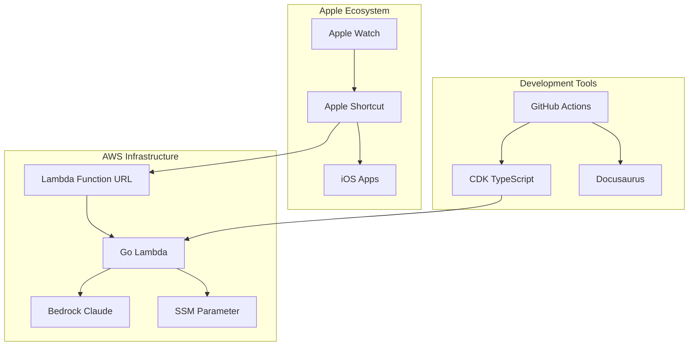

# Agent Implementation Guide

This guide is specifically designed for AI agents implementing or modifying the Wrist Agent system. It provides technical context, implementation patterns, and system architecture details needed for effective code generation and maintenance.

## System Architecture Summary

The Wrist Agent system consists of these core components:



## Key Implementation Patterns

### 1. Go Lambda Handler Pattern

The main handler follows this structure:

```go
func handler(ctx context.Context, event events.LambdaFunctionURLRequest) (events.LambdaFunctionURLResponse, error) {
    // 1. CORS handling for OPTIONS
    // 2. Authentication via header validation
    // 3. Request parsing and validation
    // 4. Bedrock API call with structured prompts
    // 5. Response parsing and formatting
    // 6. CORS response with proper headers
}
```

**Critical Implementation Details:**

- Uses `events.LambdaFunctionURLRequest` (not API Gateway events)
- Authentication via `X-Client-Token` header (case-insensitive check)
- SSM parameter cached in global variable during init()
- Bedrock Messages API with anthropic_version: "bedrock-2023-05-31"
- Extended thinking via `thinking.max_thinking_tokens` parameter

### 2. CDK Infrastructure Pattern

The CDK stack uses the experimental Go Lambda construct:

```typescript
import { GoFunction } from '@aws-cdk/aws-lambda-go-alpha';

// Key configuration for Go Lambda
new GoFunction(this, 'WristAgentHandler', {
  entry: '../lambda', // Points to Go module directory
  architecture: lambda.Architecture.ARM_64, // ARM64 for performance
  runtime: lambda.Runtime.PROVIDED_AL2, // Custom runtime
  timeout: cdk.Duration.seconds(30),
  memorySize: 256,
});
```

**Critical Implementation Details:**

- Must use `@aws-cdk/aws-lambda-go-alpha` (experimental construct)
- Entry path is relative to CDK directory (`../lambda`)
- Requires `go.mod` file in lambda directory
- Function URL with `AuthType.NONE` + CORS configuration
- SSM parameter with random initial value that must be rotated

### 3. Apple Shortcut Integration Pattern

The shortcut follows this flow:

```
Voice Input → Mode Selection → HTTP POST → Response Parsing → iOS App Creation
```

**Critical Implementation Details:**

- Uses "Get Contents of URL" action with POST method
- Headers must include `Content-Type: application/json` and `X-Client-Token`
- Request body format: `{"text": "...", "mode": "...", "maxTokens": 800}`
- Response parsing via "Get Value for Key" actions
- Conditional logic based on `action` field in response

### 4. Bedrock Integration Pattern

Claude Sonnet 4 integration uses Messages API:

```go
requestBody := map[string]interface{}{
    "anthropic_version": "bedrock-2023-05-31",
    "system":            systemPrompt,
    "messages":          messages,
    "max_tokens":        req.MaxTokens,
    "temperature":       0.1,
}

// Optional extended thinking
if req.ThinkingTokens > 0 {
    requestBody["thinking"] = map[string]interface{}{
        "max_thinking_tokens": req.ThinkingTokens,
    }
}
```

**Critical Implementation Details:**

- Model ID: `anthropic.claude-sonnet-4-20250514-v1:0`
- Must use Messages API format (not legacy Completions)
- System prompt engineering for JSON output
- Thinking tokens parameter is optional but powerful for complex queries
- Response parsing handles both structured JSON and fallback text

## Code Generation Guidelines

### When Modifying the Lambda

1. **Maintain the global client pattern**: Initialize AWS clients in `init()` function
2. **Preserve authentication flow**: Always validate `X-Client-Token` header first
3. **Keep CORS responses consistent**: Use `corsResponse()` helper for all returns
4. **Handle Bedrock errors gracefully**: Wrap in generic error messages for security
5. **Maintain request validation**: Use `validateRequest()` for input sanitization

### When Modifying CDK Infrastructure

1. **Keep ARM64 architecture**: Better performance and cost for Lambda
2. **Maintain Function URL pattern**: Avoid API Gateway for cost optimization
3. **Preserve IAM least privilege**: Only specific Bedrock model and SSM parameter access
4. **Keep SSM parameter naming consistent**: `/wrist-agent/client-token` is hardcoded in multiple places
5. **Maintain output exports**: Function URL and token parameter name are needed for setup

### When Modifying Documentation

1. **Update both human and agent guides**: Dual documentation approach
2. **Maintain Mermaid diagrams**: Visual architecture helps with understanding
3. **Keep security documentation current**: Any auth changes must be documented
4. **Update examples for API changes**: Working examples are critical for users
5. **Preserve step-by-step format**: Guides should be actionable

## Testing Patterns

### Lambda Testing

```go
func TestHandler(t *testing.T) {
    // Mock event structure
    event := events.LambdaFunctionURLRequest{
        Headers: map[string]string{
            "X-Client-Token": "test-token",
            "Content-Type":   "application/json",
        },
        Body: `{"text": "test message", "mode": "note"}`,
        RequestContext: events.LambdaFunctionURLRequestContext{
            HTTP: events.LambdaFunctionURLRequestContextHTTPDescription{
                Method: "POST",
            },
        },
    }

    // Test requires AWS credentials for Bedrock/SSM
    // Use environment variables or skip in CI
}
```

### CDK Testing

```typescript
import { Template } from 'aws-cdk-lib/assertions';

test('Lambda Function URL Created', () => {
  const template = Template.fromStack(stack);
  template.hasResourceProperties('AWS::Lambda::Url', {
    AuthType: 'NONE',
    Cors: {
      AllowOrigins: ['*'],
      AllowMethods: ['POST', 'OPTIONS'],
    },
  });
});
```

## Common Implementation Mistakes

### 1. Authentication Issues

- **Wrong header case**: Use case-insensitive header checks
- **Missing SSM permissions**: CDK must grant SSM parameter read access
- **Token caching**: Don't reload SSM parameter on every request

### 2. Bedrock Integration Issues

- **Wrong API format**: Use Messages API, not Completions
- **Missing model access**: Enable model access in Bedrock console
- **Incorrect model ID**: Use exact model ID with version suffix

### 3. CDK Configuration Issues

- **Wrong Lambda construct**: Must use `@aws-cdk/aws-lambda-go-alpha`
- **Missing bootstrap**: CDK must be bootstrapped before deployment
- **Go module path**: Entry path must point to directory containing `go.mod`

### 4. Apple Shortcut Issues

- **CORS configuration**: Function URL must allow all origins for Shortcuts
- **Response parsing**: Must handle both structured JSON and fallback responses
- **Error handling**: Network failures should create local notes with raw text

## Extension Points

### Adding New Modes

1. **Update request validation**: Add new mode to `validModes` map
2. **Create system prompt**: Add case in `buildSystemPrompt()` function
3. **Update documentation**: Add mode to API docs and examples
4. **Update shortcut**: Add new option to mode selection menu

### Adding New Authentication

1. **Modify header validation**: Update authentication logic in handler
2. **Update SSM structure**: Change parameter format if needed
3. **Update CDK permissions**: Grant access to new auth resources
4. **Update documentation**: Security guide and setup instructions

### Adding New Response Formats

1. **Update response struct**: Modify `Response` type in Go
2. **Update system prompts**: Change JSON schema in prompts
3. **Update shortcut parsing**: Handle new fields in Apple Shortcut
4. **Update examples**: Show new format in documentation

## Deployment Automation

### GitHub Actions Integration

The system uses OIDC for secure deployments:

```yaml
- name: Configure AWS credentials
  uses: aws-actions/configure-aws-credentials@v4
  with:
    role-to-assume: ${{ secrets.AWS_ROLE_ARN }}
    aws-region: us-west-2
    role-session-name: GitHubActions-WristAgent
```

**Key Implementation Notes:**

- No AWS keys stored in repository
- OIDC role must trust specific repository
- Deployment triggers on changes to `cdk/**` or `lambda/**` paths
- Security scanning with Trivy included

### Documentation Deployment

Docusaurus deploys to GitHub Pages:

```yaml
- name: Upload artifact
  uses: actions/upload-pages-artifact@v3
  with:
    path: docs/build
```

**Key Implementation Notes:**

- Builds on changes to `docs/**` path
- Uses GitHub Pages environment
- Includes broken link checking
- Deploys only from main branch

## Performance Optimization

### Lambda Cold Start Optimization

- **ARM64 architecture**: ~20% faster than x86_64
- **Minimal memory**: 256MB sufficient for most requests
- **Client reuse**: Global AWS clients cached in init()
- **Go runtime**: Faster cold starts than Node.js/Python

### Bedrock Cost Optimization

- **Structured prompts**: Reduce token usage with clear instructions
- **Temperature 0.1**: More deterministic, less token waste
- **Max tokens limit**: Default 800, configurable per request
- **Thinking tokens**: Only use for complex queries (costs extra)

## Monitoring and Observability

### CloudWatch Integration

The Lambda automatically logs:

- Request processing steps
- Authentication failures
- Bedrock API calls and responses
- Error conditions with context

### Key Metrics to Monitor

```bash
# Lambda invocations
aws cloudwatch get-metric-statistics \
  --namespace AWS/Lambda \
  --metric-name Invocations \
  --dimensions Name=FunctionName,Value=WristAgentStack-WristAgentHandler

# Error rates
aws cloudwatch get-metric-statistics \
  --namespace AWS/Lambda \
  --metric-name Errors \
  --dimensions Name=FunctionName,Value=WristAgentStack-WristAgentHandler
```

## Security Implementation Notes

### Token Management

- Initial token generated with Math.random() - **must be rotated**
- Production should use crypto-secure generation: `openssl rand -base64 32`
- Token rotation requires updating both SSM and Apple Shortcut

### IAM Permissions

- Lambda execution role has minimal permissions
- Bedrock access scoped to specific model ARN
- SSM access scoped to specific parameter
- No persistent storage or database access needed

This agent guide provides the technical foundation for implementing, modifying, and maintaining the Wrist Agent system. Always refer to the current codebase for the most up-to-date implementation details.
