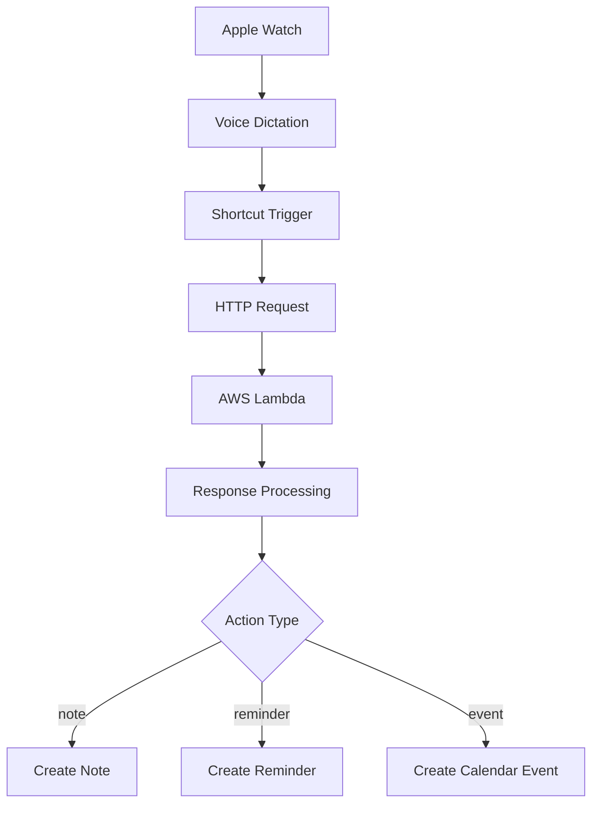

# Apple Shortcut Integration

This guide will help you create and configure the Apple Shortcut that connects your Apple Watch to the Wrist Agent system.

## Overview

The Apple Shortcut acts as the bridge between your Apple Watch dictation and the AWS Lambda function. It captures voice input, sends it to your deployed endpoint, and processes the response to create Notes, Reminders, or Calendar events.



## Step 1: Get Your Configuration

Before creating the shortcut, gather these details from your AWS deployment:

1. **Function URL**: From CDK output or AWS Console
2. **Authentication Token**: From SSM Parameter Store

```bash
# Get your Function URL
aws cloudformation describe-stacks \
  --stack-name WristAgentStack \
  --query 'Stacks[0].Outputs[?OutputKey==`FunctionUrl`].OutputValue' \
  --output text

# Get your authentication token
aws ssm get-parameter \
  --name "/wrist-agent/client-token" \
  --with-decryption \
  --query 'Parameter.Value' \
  --output text
```

## Step 2: Create the Basic Shortcut

### Method A: Import Shortcut (Recommended)

1. **Download the shortcut file**: [WristAgent.shortcut](../static/shortcuts/WristAgent.shortcut)
2. **Open in Shortcuts app** on your iPhone
3. **Configure parameters** (see Configuration section below)

### Method B: Manual Creation

1. **Open Shortcuts app** on iPhone
2. **Tap "+" to create new shortcut**
3. **Add actions in this order**:

#### Action 1: Get Text from Input

- Search for "Get Text from Input"
- Set source to "Ask for Input"
- Input Type: "Text"
- Prompt: "What would you like to record?"
- Allow Multiline: ON

#### Action 2: Text Action for Mode Selection

- Search for "Ask for Input"
- Input Type: "Choose from Menu"
- Prompt: "Select mode:"
- Menu Items:
  - "Note" → Set variable to "note"
  - "Reminder" → Set variable to "reminder"
  - "Calendar Event" → Set variable to "event"
  - "Research" → Set variable to "research"
  - "Deep Think" → Set variable to "deepthink"

#### Action 3: Get Contents of URL

- URL: `https://YOUR_FUNCTION_URL`
- Method: POST
- Headers:
  - `Content-Type`: `application/json`
  - `X-Client-Token`: `YOUR_TOKEN`
- Request Body:

```json
{
  "text": "TEXT_FROM_STEP_1",
  "mode": "MODE_FROM_STEP_2",
  "maxTokens": 800,
  "thinkingTokens": 0
}
```

#### Action 4: Get Value for Key

- Get Value for: "action" in Contents of URL

#### Action 5: Choose from Menu (Based on Action)

- Input: Value from Step 4
- Cases:
  - **note**: Create Note action
  - **reminder**: Create Reminder action
  - **event**: Create Calendar Event action

#### Action 6a: Create Note

- Get Value for "markdown" from Contents of URL
- Get Value for "title" from Contents of URL
- Create Note with title and markdown content

#### Action 6b: Create Reminder

- Get Value for "title" from Contents of URL
- Get Value for "dueISO" from Contents of URL
- Create Reminder with title and due date

#### Action 6c: Create Calendar Event

- Get Value for "title" from Contents of URL
- Get Value for "startISO" from Contents of URL
- Get Value for "endISO" from Contents of URL
- Get Value for "location" from Contents of URL
- Get Value for "url" from Contents of URL
- Get Value for "notes" from Contents of URL
- Create Calendar Event with title, start/end, location, URL, and notes

## Step 3: Configure Advanced Options

### Extended Thinking Mode

For complex queries, enable extended thinking:

```json
{
  "text": "Analyze the pros and cons of renewable energy",
  "mode": "deepthink",
  "maxTokens": 2000,
  "thinkingTokens": 10000
}
```

### Custom Modes

Add custom handling for specific use cases:

```javascript
// In your shortcut logic
if (mode === 'quick-note') {
  // Skip mode selection, default to note
  mode = 'note';
  maxTokens = 400;
}
```

## Step 4: Add Watch Complication

1. **Open Watch app** on iPhone
2. **Go to My Watch tab**
3. **Select your watch face**
4. **Tap "Complications"**
5. **Choose a complication slot**
6. **Select "Shortcuts"**
7. **Choose your Wrist Agent shortcut**

### Supported Complications

- **Corner**: Small icon launch
- **Circular**: Round button with icon
- **Modular Large**: Text display with launch
- **Infograph**: Multiple size options

## Step 5: Testing and Validation

### Test the Basic Flow

1. **Launch shortcut** from Watch or iPhone
2. **Speak your request**: "Create a note about today's meeting with John"
3. **Select mode**: Choose "Note"
4. **Verify creation**: Check that a note was created with proper formatting

### Test Different Modes

#### Note Mode

Input: "Meeting notes from today's standup"
Expected: Well-formatted note with title and content

#### Reminder Mode

Input: "Remind me to call mom tomorrow at 3pm"
Expected: Reminder with extracted due date

#### Calendar Event Mode

Input: "Schedule dentist appointment next Friday at 2pm"
Expected: Calendar event with start/end time, location, and notes when provided

#### Research Mode

Input: "What are the latest developments in quantum computing?"
Expected: Detailed note with research information

#### Deep Think Mode

Input: "Should I buy or rent a house in San Francisco?"
Expected: Thoughtful analysis with pros/cons

### Common Issues and Solutions

**Shortcut fails with 401 error**

- Verify token is correctly configured
- Check token matches SSM parameter value

**Response is empty or malformed**

- Check Function URL is correct
- Verify Lambda is deployed and running

**Watch complication doesn't appear**

- Restart Apple Watch
- Re-sync shortcuts from iPhone

**Voice dictation is inaccurate**

- Speak clearly and pause between sentences
- Use the research mode for better processing of unclear text

## Step 6: Customize the Experience

### Add Siri Shortcuts

1. **Record Siri phrase**: "Hey Siri, Wrist Agent"
2. **Set up variations**:
   - "Take a note"
   - "Add reminder"
   - "Schedule event"

### Batch Processing

Create variants for common patterns:

```javascript
// Meeting notes shortcut
{
  "text": dictatedText,
  "mode": "note",
  "maxTokens": 1200,
  "thinkingTokens": 0
}

// Quick reminder shortcut
{
  "text": dictatedText,
  "mode": "reminder",
  "maxTokens": 400,
  "thinkingTokens": 0
}
```

### Error Handling

Add error handling for network issues:

```javascript
// In shortcut logic
try {
  // API call
} catch (error) {
  // Create local note with raw text
  // Show notification about sync failure
}
```

## Example Shortcut JSON

Here's the complete shortcut configuration for manual setup:

```json
{
  "WFWorkflowActions": [
    {
      "WFWorkflowActionIdentifier": "is.workflow.actions.gettext",
      "WFWorkflowActionParameters": {
        "WFTextActionText": "Ask for Input",
        "WFAskActionPrompt": "What would you like to record?",
        "WFInputType": "Text"
      }
    },
    {
      "WFWorkflowActionIdentifier": "is.workflow.actions.choosefrommenu",
      "WFWorkflowActionParameters": {
        "WFControlFlowMode": 0,
        "WFMenuPrompt": "Select mode:",
        "WFMenuItems": ["Note", "Reminder", "Event", "Research", "Deep Think"]
      }
    },
    {
      "WFWorkflowActionIdentifier": "is.workflow.actions.downloadurl",
      "WFWorkflowActionParameters": {
        "WFHTTPMethod": "POST",
        "WFURL": "https://YOUR_FUNCTION_URL",
        "WFHTTPHeaders": {
          "Content-Type": "application/json",
          "X-Client-Token": "YOUR_TOKEN"
        },
        "WFRequestVariable": {
          "text": "TEXT_FROM_INPUT",
          "mode": "SELECTED_MODE",
          "maxTokens": 800
        }
      }
    }
  ]
}
```

## Next Steps

Once your shortcut is working:

1. **[Review Security Settings](./security)** - Understand token management
2. **[Explore API Examples](./examples)** - Test advanced features
3. **[Check Troubleshooting](./troubleshooting)** - Common issues and solutions

Your Apple Watch is now connected to Claude Haiku 4.5! Tap your complication and start capturing ideas with the power of AI.
