# Apple Shortcut Integration

This guide will help you create and configure the Apple Shortcut that connects your Apple Watch to the Wrist Agent system.

## Overview


## Prerequisites

Before configuring the shortcut, gather these details from your AWS deployment:

```bash
# Get your API Gateway URL
aws cloudformation describe-stacks \
  --stack-name WristAgentStack \
  --query 'Stacks[0].Outputs[?OutputKey==`InvokeEndpoint`].OutputValue' \
  --output text

# Get your authentication token
aws ssm get-parameter \
  --name "/wrist-agent/client-token" \
  --with-decryption \
  --query 'Parameter.Value' \
  --output text
```

## Step 1: Download or Create Shortcut

### Option A: Import Pre-built Shortcut (Recommended)

1. Download [WristAgent.shortcut](../static/shortcuts/WristAgent.shortcut)
2. Open in Shortcuts app on iPhone
3. Configure your API endpoint and token (Step 2)

### Option B: Create Manually

Create a new shortcut with these actions:


## Step 2: Configure Shortcut

### Required Settings

| Setting            | Value                                                                 |
| ------------------ | --------------------------------------------------------------------- |
| **API URL**        | `https://YOUR_API_ID.execute-api.us-west-2.amazonaws.com/prod/invoke` |
| **Method**         | POST                                                                  |
| **Content-Type**   | application/json                                                      |
| **X-Client-Token** | Your token from SSM                                                   |

### HTTP Request Configuration

```json
{
  "text": "[Dictated Text]",
  "mode": "[Selected Mode]",
  "maxTokens": 800,
  "thinkingTokens": 0
}
```

### Mode Options

| Mode        | Use Case              | Action                  |
| ----------- | --------------------- | ----------------------- |
| `note`      | General notes, ideas  | Creates Apple Note      |
| `reminder`  | Tasks with due dates  | Creates Reminder        |
| `event`     | Calendar appointments | Creates Calendar Event  |
| `research`  | Detailed information  | Creates detailed Note   |
| `deepthink` | Complex analysis      | Creates analytical Note |

## Step 3: Shortcut Actions Detail

### Action 1: Dictate Text

```
Action: Dictate Text
Settings:
  - Stop Listening: After Pause
  - Language: Default
Output: Dictated Text
```

### Action 2: Choose from Menu

```
Action: Choose from Menu
Prompt: "Select mode:"
Options:
  - 📝 Note → "note"
  - ⏰ Reminder → "reminder"
  - 📅 Event → "event"
  - 🔍 Research → "research"
  - 🧠 Deep Think → "deepthink"
Output: Selected Mode
```

### Action 3: Get Contents of URL

```
Action: Get Contents of URL
URL: https://YOUR_API_ID.execute-api.us-west-2.amazonaws.com/prod/invoke
Method: POST
Headers:
  Content-Type: application/json
  X-Client-Token: YOUR_TOKEN_HERE
Request Body (JSON):
  {
    "text": [Dictated Text],
    "mode": [Selected Mode],
    "maxTokens": 800
  }
Output: API Response
```

### Action 4: Parse Response

```
Action: Get Dictionary Value
Key: action
From: API Response
Output: Action Type

Action: Get Dictionary Value
Key: title
From: API Response
Output: Title

Action: Get Dictionary Value
Key: markdown
From: API Response
Output: Content
```

### Action 5: Create Output

```mermaid
flowchart TD
    subgraph Note["📝 Note Action"]
        N1[Get 'title' from response]
        N2[Get 'markdown' from response]
        N3[Create Note with title + content]
    end
    
    subgraph Reminder["⏰ Reminder Action"]
        R1[Get 'title' from response]
        R2[Get 'dueISO' from response]
        R3[Create Reminder with title + due date]
    end
    
    subgraph Event["📅 Event Action"]
        E1[Get 'title' from response]
        E2[Get 'startISO' from response]
        E3[Get 'endISO' from response]
        E4[Get 'location' from response]
        E5[Create Event with all fields]
    end
```



## Step 4: Add Watch Complication

### Configure Watch Face

1. Open **Watch** app on iPhone
2. Select **My Watch** → **Clock**
3. Choose your watch face
4. Tap **Complications**
5. Select a slot → **Shortcuts** → **Wrist Agent**

### Supported Complications

| Type      | Size     | Appearance         |
| --------- | -------- | ------------------ |
| Corner    | Small    | Icon only          |
| Circular  | Medium   | Icon + name        |
| Modular   | Large    | Icon + description |
| Infograph | Variable | Customizable       |

## Step 5: Test the Integration

### Quick Test

1. Tap the complication on your Apple Watch
2. Say: "Create a note about testing Wrist Agent"
3. Select "📝 Note"
4. Verify a note is created

### Test Each Mode

```mermaid
flowchart LR
    subgraph Tests["Test Cases"]
        T1["📝 'Meeting notes from today'"]
        T2["⏰ 'Remind me to call mom at 3pm'"]
        T3["📅 'Dentist appointment Friday 2pm'"]
        T4["🔍 'Research quantum computing'"]
        T5["🧠 'Analyze pros and cons of remote work'"]
    end
```



| Input                                    | Expected Mode | Expected Output        |
| ---------------------------------------- | ------------- | ---------------------- |
| "Note about project ideas"               | note          | Apple Note created     |
| "Remind me to buy groceries tomorrow"    | reminder      | Reminder with due date |
| "Meeting with team Friday 10am"          | event         | Calendar event         |
| "Research best practices for API design" | research      | Detailed note          |
| "Should I learn Rust or Go?"             | deepthink     | Analytical note        |

## Advanced Configuration

### Extended Thinking

For complex analysis, enable extended thinking:

```json
{
  "text": "Analyze the implications of AI on employment",
  "mode": "deepthink",
  "maxTokens": 2000,
  "thinkingTokens": 10000
}
```

### Quick Shortcuts

Create simplified shortcuts for common tasks:

| Shortcut Name  | Preset Mode | Max Tokens |
| -------------- | ----------- | ---------- |
| Quick Note     | note        | 400        |
| Quick Reminder | reminder    | 400        |
| Quick Event    | event       | 400        |
| Research       | research    | 1200       |
| Deep Analysis  | deepthink   | 2000       |

### Error Handling

Add error handling to your shortcut:


## Response Format Reference

### Successful Response

```json
{
  "markdown": "# Meeting Notes\n\nDiscussed project timeline...",
  "action": "note",
  "title": "Meeting Notes",
  "dueISO": null,
  "startISO": null,
  "endISO": null,
  "location": null,
  "url": null,
  "notes": null,
  "tags": ["note", "meeting"]
}
```

### Response Fields

| Field      | Type        | Used By                |
| ---------- | ----------- | ---------------------- |
| `markdown` | string      | Note content           |
| `action`   | string      | Determines output type |
| `title`    | string      | All output types       |
| `dueISO`   | string/null | Reminders              |
| `startISO` | string/null | Events                 |
| `endISO`   | string/null | Events                 |
| `location` | string/null | Events                 |
| `url`      | string/null | Events                 |
| `notes`    | string/null | Events                 |
| `tags`     | array       | All types              |

## Troubleshooting

### Common Issues

**Shortcut fails with 401/403**
- Verify X-Client-Token header is set
- Check token matches SSM parameter
- Ensure token hasn't been rotated

**Shortcut times out**
- Check internet connectivity
- Verify API Gateway URL is correct
- Try with shorter input text

**Note/Reminder not created**
- Check response parsing in shortcut
- Verify "action" field in response
- Enable shortcut debugging

**Dictation not working**
- Enable Dictation in Settings
- Check microphone permissions
- Try speaking more clearly

### Debug Mode

Add debugging to your shortcut:

1. After API call, add **Quick Look** action
2. View the raw response
3. Verify all expected fields are present

## Security Considerations

### Token Storage

- Token is visible in Shortcut configuration
- Don't share shortcuts containing your token
- Rotate token if device is compromised

### Device Security

- Use device passcode/Face ID
- Enable "Erase Data" after failed attempts
- Keep iOS/watchOS updated

## Next Steps

- **[Security Configuration](./security)** - Token management
- **[API Examples](./examples)** - Test different modes
- **[Troubleshooting](./troubleshooting)** - Common issues

Your Apple Watch is now connected to Claude Haiku 4.5! 🎉
