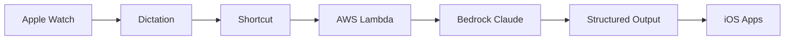

# Introduction

Welcome to **Wrist Agent** - a seamless Apple Watch to AWS Bedrock integration system that enables one-tap voice capture, intelligent processing through Claude Haiku 4.5, and automatic creation of Notes, Reminders, or Calendar events.

## What is Wrist Agent?

Wrist Agent solves the limitations of Apple Watch voice-to-text capture by providing a comprehensive flow:

**Watch Dictation** → **Shortcut** → **Lambda** → **Bedrock** → **Structured Output** → **iOS Apps**

## Key Features

- **🎙️ One-Tap Voice Capture**: Direct from Apple Watch with complication support
- **🧠 AI Processing**: Claude Haiku 4.5 with optional extended thinking (up to 65K thinking tokens)
- **📱 Native Integration**: Seamlessly creates Notes, Reminders, and Calendar events
- **🔒 Secure**: Header-based authentication with SSM Parameter Store
- **💰 Cost-Optimized**: Lambda Function URLs instead of API Gateway
- **⚡ Fast**: ARM64 Lambda with sub-second response times
- **🚀 CI/CD Ready**: GitHub Actions with OIDC deployment

## Architecture Overview

### AWS Infrastructure

- **AWS Lambda**: Go 1.22+ runtime with custom runtime (provided.al2)
- **AWS Bedrock**: Claude Haiku 4.5 integration with Messages API
- **Lambda Function URLs**: Direct HTTPS endpoints with CORS support
- **SSM Parameter Store**: Secure token management (Standard tier)
- **IAM Roles**: Least privilege access control

### Apple Integration

- **Apple Shortcuts**: Custom shortcut with Watch complication
- **Voice Recognition**: Native iOS dictation with error handling
- **App Integration**: Direct output to Notes, Reminders, Calendar

### Security Model

- **Authentication**: Shared token stored in SSM Parameter Store
- **Transport Security**: HTTPS with CORS configuration
- **Access Control**: Function URL public access with token validation
- **No Long-lived Credentials**: OIDC integration for deployments

## Quick Start

Get started in 3 steps:

1. **[Setup Infrastructure](./setup)** - Deploy AWS resources with CDK
2. **[Configure Security](./security)** - Set up authentication tokens
3. **[Install Shortcut](./apple-shortcut)** - Add to Apple Watch

## Use Cases

### 📝 Note Taking

Convert voice recordings into well-formatted notes with titles and tags.

### ⏰ Reminders

Create time-based reminders with automatic date/time extraction.

### 📅 Calendar Events

Schedule events with intelligent date/time parsing.

### 🔍 Research Mode

Get detailed, well-researched responses with sources.

### 🤔 Deep Thinking

Enable extended reasoning with up to 65K thinking tokens for complex queries.

## Cost Estimation

Typical monthly costs for moderate usage (100 requests/day):

- **Lambda Invocations**: ~$0.50
- **Bedrock Claude Haiku 4.5**: ~$15-30 (depending on token usage)
- **SSM Parameter Store**: ~$0.05
- **Total**: **~$15-31/month**

## Getting Started

Ready to build your Wrist Agent system? Head to the [Setup Guide](./setup) to deploy your infrastructure and start capturing ideas with a tap on your wrist!
