# Security Configuration

This guide covers the security model, best practices, and configuration for your Wrist Agent deployment.

## Security Architecture

```mermaid
flowchart TB
    subgraph Client["📱 Client"]
        WATCH[Apple Watch]
        SHORT[Shortcut]
    end
    
    subgraph Edge["🔒 API Gateway"]
        APIGW[REST API]
        CORS[CORS Policy]
        THROTTLE[Rate Limiting]
    end
    
    subgraph Auth["🛡️ Authorization"]
        AUTHORIZER[Lambda Authorizer]
        POLICY[IAM Policy]
    end
    
    subgraph Secrets["🔐 Secrets"]
        SSM[(SSM Parameter)]
    end
    
    subgraph Backend["⚡ Backend"]
        HANDLER[Handler Lambda]
        BEDROCK[Amazon Bedrock]
    end
    
    WATCH --> SHORT
    SHORT -->|HTTPS + Token| APIGW
    APIGW --> CORS
    CORS --> THROTTLE
    THROTTLE --> AUTHORIZER
    AUTHORIZER -->|Validate| SSM
    AUTHORIZER -->|Allow/Deny| POLICY
    POLICY -->|Invoke| HANDLER
    HANDLER --> BEDROCK
```



## Authentication Flow


## Security Layers

### Layer 1: Transport Security

All communication uses HTTPS with TLS 1.2+:

| Component   | Protocol | Certificate |
| ----------- | -------- | ----------- |
| API Gateway | HTTPS    | AWS Managed |
| Lambda      | Internal | N/A         |
| SSM         | Internal | N/A         |
| Bedrock     | Internal | N/A         |

### Layer 2: API Gateway Protection


**Built-in protections:**

- **CORS Policy**: Restricts allowed headers and methods
- **Throttling**: 10 requests/second, 20 burst
- **Access Logging**: All requests logged to CloudWatch
- **Regional Endpoint**: Reduces attack surface

### Layer 3: Lambda Authorizer

The Lambda Authorizer validates every request before it reaches the handler:

```go
// Token validation with caching
func handler(ctx context.Context, event events.APIGatewayCustomAuthorizerRequestTypeRequest) {
    token := extractToken(event)           // Get X-Client-Token header
    expectedToken := getExpectedToken(ctx) // From SSM (cached 5 min)
    
    if token == expectedToken {
        return generatePolicy("Allow", event.MethodArn)
    }
    return generatePolicy("Deny", event.MethodArn)
}
```

**Security features:**

- Token cached for 5 minutes (reduces SSM calls)
- Case-insensitive header matching
- Returns IAM policy (not just boolean)
- Authorization result cached by API Gateway

### Layer 4: IAM Permissions

Each component has least-privilege permissions:


## Token Management

### Token Properties

| Property   | Value                 |
| ---------- | --------------------- |
| Type       | Base64-encoded string |
| Length     | 32 bytes (256 bits)   |
| Storage    | SSM Parameter Store   |
| Encryption | AWS managed           |
| Cache TTL  | 5 minutes             |

### Generate a Secure Token

```bash
# Generate cryptographically secure token
TOKEN=$(openssl rand -base64 32)

# Update SSM parameter
aws ssm put-parameter \
  --name "/wrist-agent/client-token" \
  --value "$TOKEN" \
  --type "String" \
  --overwrite

# Display token (copy to Shortcut)
echo "New Token: $TOKEN"
```

### Token Rotation


**Rotation process:**

1. Generate new token: `openssl rand -base64 32`
2. Update SSM parameter
3. Wait up to **10 minutes** for full cache expiry (see below)
4. Update Apple Shortcut with new token

### ⚠️ Cache Propagation Delay

Token rotation has a **maximum 10-minute propagation delay** due to dual-layer caching:

| Cache Layer                  | TTL       | Purpose                                  |
| ---------------------------- | --------- | ---------------------------------------- |
| API Gateway Authorizer Cache | 5 minutes | Caches authorization decisions per token |
| Lambda Token Cache           | 5 minutes | Caches SSM parameter value               |

**Worst-case scenario:**
1. Old token cached in Lambda (just refreshed) → 5 min remaining
2. Authorization result cached in API Gateway (just cached) → 5 min remaining
3. Total delay: **up to 10 minutes**

**Emergency token invalidation:**

For immediate token invalidation (security incident), you must:

```bash
# 1. Rotate the token in SSM
aws ssm put-parameter \
  --name "/wrist-agent/client-token" \
  --value "$(openssl rand -base64 32)" \
  --overwrite

# 2. Force Lambda cache refresh by redeploying the authorizer
aws lambda update-function-configuration \
  --function-name WristAgentStack-WristAgentAuthorizer \
  --environment "Variables={FORCE_REFRESH=$(date +%s)}"

# 3. Clear API Gateway cache (if stage caching enabled)
aws apigateway flush-stage-authorizers-cache \
  --rest-api-id YOUR_API_ID \
  --stage-name prod
```

**Reducing propagation delay:**

To reduce the delay, lower the cache TTLs (trade-off: more SSM calls, higher latency):

```bash
# In CDK stack, reduce authorizer cache TTL
authorizerResultTtl: cdk.Duration.minutes(1)  # Default: 5 min

# In Lambda environment, reduce token cache TTL
TOKEN_CACHE_TTL_SECONDS=60  # Default: 300 (5 min)
```

### Recommended Rotation Schedule

| Environment      | Frequency     |
| ---------------- | ------------- |
| Personal         | Every 90 days |
| Shared           | Every 30 days |
| After compromise | Immediately   |

## Rate Limiting

API Gateway provides built-in throttling:

```mermaid
flowchart LR
    subgraph Limits["Rate Limits"]
        RATE[10 req/sec steady]
        BURST[20 req burst]
    end
    
    REQ[Requests] --> RATE
    RATE --> BURST
    BURST --> |Under Limit| OK[✅ Process]
    BURST --> |Over Limit| REJECT[❌ 429 Error]
```



| Setting     | Value     | Purpose                 |
| ----------- | --------- | ----------------------- |
| Rate Limit  | 10/second | Steady state throughput |
| Burst Limit | 20        | Handle traffic spikes   |
| Cache TTL   | 5 minutes | Authorization caching   |

## Monitoring and Alerting

### CloudWatch Metrics

Monitor these metrics for security events:

| Metric   | Threshold  | Alert             |
| -------- | ---------- | ----------------- |
| 4XXError | > 10/min   | Possible attack   |
| 5XXError | > 5/min    | System issue      |
| Count    | > 100/hour | Unusual usage     |
| Latency  | > 5000ms   | Performance issue |

### Set Up Alerts

```bash
# Alert on authentication failures
aws cloudwatch put-metric-alarm \
  --alarm-name "WristAgent-AuthFailures" \
  --metric-name "4XXError" \
  --namespace "AWS/ApiGateway" \
  --statistic "Sum" \
  --period 300 \
  --threshold 10 \
  --comparison-operator "GreaterThanThreshold" \
  --evaluation-periods 2 \
  --alarm-actions "arn:aws:sns:us-west-2:ACCOUNT:alerts"
```

### View Logs

```bash
# View API Gateway access logs
aws logs filter-log-events \
  --log-group-name "/aws/api-gateway/WristAgentApi" \
  --start-time $(date -d '1 hour ago' +%s)000

# View Authorizer logs
aws logs filter-log-events \
  --log-group-name "/aws/lambda/WristAgentStack-WristAgentAuthorizer" \
  --filter-pattern "Authorization denied"
```

## Incident Response

### Compromised Token

```mermaid
flowchart TD
    DETECT[🚨 Detect Compromise] --> ROTATE[1. Rotate Token]
    ROTATE --> UPDATE[2. Update Shortcut]
    UPDATE --> REVIEW[3. Review Logs]
    REVIEW --> ASSESS[4. Assess Impact]
    ASSESS --> REPORT[5. Document Incident]
```



**Steps:**

1. **Rotate immediately:**
   ```bash
   aws ssm put-parameter \
     --name "/wrist-agent/client-token" \
     --value "$(openssl rand -base64 32)" \
     --overwrite
   ```

2. **Update Apple Shortcut** with new token

3. **Review CloudWatch logs** for unauthorized access

4. **Assess impact** - check for unusual Bedrock usage

5. **Document** the incident and response

### Unusual Activity Detection

Signs to monitor:

- High volume of 403 responses (token guessing)
- Requests from unexpected IP ranges
- Unusual request patterns (automated probing)
- Spike in Bedrock costs

## Security Best Practices

### Do's ✅

- Rotate tokens regularly (every 90 days)
- Monitor CloudWatch logs and metrics
- Keep CDK and dependencies updated
- Use unique tokens per device (if multiple)
- Enable CloudTrail for audit logging

### Don'ts ❌

- Share tokens via insecure channels
- Commit tokens to version control
- Disable the Lambda Authorizer
- Share Shortcuts with embedded tokens
- Ignore 4XX error spikes

## Compliance Notes

### Data Handling

| Data Type   | Storage    | Retention     |
| ----------- | ---------- | ------------- |
| Voice Text  | Not stored | Transient     |
| API Logs    | CloudWatch | 7 days        |
| Auth Tokens | SSM        | Until rotated |
| Bedrock I/O | Not stored | Transient     |

### Regional Deployment

Deploy to specific regions for compliance:

```bash
# EU deployment
export AWS_REGION=eu-west-1
cd cdk && npx cdk deploy

# US deployment  
export AWS_REGION=us-west-2
cd cdk && npx cdk deploy
```

## Security Checklist

Before going live:

- [ ] Token rotated from default value
- [ ] CloudWatch alarms configured
- [ ] Access logs enabled
- [ ] Throttling configured appropriately
- [ ] Apple Shortcut on trusted devices only
- [ ] Backup plan for token recovery
- [ ] Regular rotation schedule documented

## Next Steps

- **[Test Your Setup](./examples)** - Verify security configuration
- **[Troubleshooting](./troubleshooting)** - Common security issues
- **[Apple Shortcut](./apple-shortcut)** - Secure client configuration
