# Setup Guide

This guide will help you deploy the complete Wrist Agent infrastructure on AWS and configure it for use with your Apple Watch.

## Architecture Overview


## Prerequisites

Before you begin, ensure you have:

| Requirement | Version | Purpose                     |
| ----------- | ------- | --------------------------- |
| AWS Account | -       | Host infrastructure         |
| AWS CLI     | 2.x     | Deploy and manage resources |
| Node.js     | 18+     | CDK and build tools         |
| Go          | 1.22+   | Lambda functions            |
| Git         | -       | Clone repository            |

## Step 1: Clone and Setup Repository

```bash
# Clone the repository
git clone https://github.com/Stealinglight/wrist-agent.git
cd wrist-agent

# Install CDK dependencies
cd cdk
npm install

# Install Go dependencies for main handler
cd ../lambda
go mod tidy

# Install Go dependencies for authorizer
cd ../lambda-authorizer
go mod tidy

# Return to project root
cd ..
```

## Step 2: Configure Environment

Copy the environment template and configure your settings:

```bash
cp .env.example .env
```

Edit `.env` with your preferred settings:

```bash
# AWS Configuration
AWS_REGION=us-west-2
AWS_PROFILE=default

# Bedrock Configuration
BEDROCK_MODEL_ID=anthropic.claude-haiku-4-5-20251001-v1:0

# Security Configuration
CLIENT_TOKEN_PARAM_NAME=/wrist-agent/client-token
CLIENT_TOKEN=your_shared_token_here

# Lambda Configuration
LAMBDA_TIMEOUT=30
LAMBDA_MEMORY=256
```

## Step 3: Deploy Infrastructure

```mermaid
flowchart LR
    subgraph Local["💻 Local Machine"]
        CDK[CDK App]
        BUILD[npm run build]
    end
    
    subgraph Deploy["🚀 Deployment"]
        SYNTH[cdk synth]
        DEPLOY[cdk deploy]
    end
    
    subgraph AWS["☁️ AWS"]
        CF[CloudFormation]
        STACK[WristAgentStack]
    end
    
    CDK --> BUILD
    BUILD --> SYNTH
    SYNTH --> DEPLOY
    DEPLOY --> CF
    CF --> STACK
```



### Option A: Local Deployment

```bash
# Navigate to CDK directory
cd cdk

# Bootstrap CDK (first time only)
npx cdk bootstrap

# Build and deploy
npm run build
npx cdk deploy

# Note the API Gateway URL from the output
```

### Option B: GitHub Actions Deployment

1. **Fork the repository** to your GitHub account

2. **Configure GitHub Secrets**:
   - Go to Repository Settings → Secrets and variables → Actions
   - Add `AWS_ROLE_ARN` with your OIDC role ARN

3. **Setup OIDC Role** (if not already configured):

```bash
# Create OIDC identity provider (one-time setup)
aws iam create-open-id-connect-provider \
  --url https://token.actions.githubusercontent.com \
  --client-id-list sts.amazonaws.com \
  --thumbprint-list 6938fd4d98bab03faadb97b34396831e3780aea1

# Create role with trust policy for your repo
# Replace YOUR_GITHUB_USERNAME and YOUR_REPO_NAME
cat > trust-policy.json << EOF
{
  "Version": "2012-10-17",
  "Statement": [
    {
      "Effect": "Allow",
      "Principal": {
        "Federated": "arn:aws:iam::$(aws sts get-caller-identity --query Account --output text):oidc-provider/token.actions.githubusercontent.com"
      },
      "Action": "sts:AssumeRoleWithWebIdentity",
      "Condition": {
        "StringEquals": {
          "token.actions.githubusercontent.com:aud": "sts.amazonaws.com"
        },
        "StringLike": {
          "token.actions.githubusercontent.com:sub": "repo:YOUR_GITHUB_USERNAME/YOUR_REPO_NAME:*"
        }
      }
    }
  ]
}
EOF

aws iam create-role \
  --role-name WristAgentGitHubActions \
  --assume-role-policy-document file://trust-policy.json

aws iam attach-role-policy \
  --role-name WristAgentGitHubActions \
  --policy-arn arn:aws:iam::aws:policy/PowerUserAccess
```

4. **Push to main branch** to trigger deployment

## Step 4: Verify Deployment

After deployment completes, you should see outputs similar to:

```
Outputs:
WristAgentStack.ApiEndpoint = https://abc123def.execute-api.us-west-2.amazonaws.com/prod/
WristAgentStack.InvokeEndpoint = https://abc123def.execute-api.us-west-2.amazonaws.com/prod/invoke
WristAgentStack.TokenParameterName = /wrist-agent/client-token
```

Test the API endpoint:

```bash
# Get the client token
TOKEN=$(aws ssm get-parameter --name "/wrist-agent/client-token" --with-decryption --query 'Parameter.Value' --output text)

# Test the endpoint
curl -X POST "https://YOUR_API_ENDPOINT/prod/invoke" \
  -H "Content-Type: application/json" \
  -H "X-Client-Token: $TOKEN" \
  -d '{"text": "Create a note about testing the Wrist Agent system", "mode": "note"}'
```

Expected response:

```json
{
  "markdown": "# Testing the Wrist Agent System\n\n✅ Successfully tested...",
  "action": "note",
  "title": "Testing the Wrist Agent System",
  "dueISO": null,
  "startISO": null,
  "endISO": null,
  "location": null,
  "url": null,
  "notes": null,
  "tags": ["note", "testing"]
}
```

## Step 5: Configure Authentication Token


For security, update the default authentication token:

```bash
# Generate a secure token
TOKEN=$(openssl rand -base64 32)

# Update the SSM parameter
aws ssm put-parameter \
  --name "/wrist-agent/client-token" \
  --value "$TOKEN" \
  --type "String" \
  --overwrite

# Save the token securely - you'll need it for the Apple Shortcut
echo "Your Wrist Agent Token: $TOKEN"
```

## Step 6: Enable Bedrock Model Access

Ensure Claude Haiku 4.5 is enabled in your AWS region:

1. Go to **AWS Bedrock Console** → **Model Access**
2. Request access to **Anthropic Claude Haiku 4.5**
3. Wait for approval (usually instant for Claude models)

## Deployed Resources

| Resource             | Type                 | Purpose                        |
| -------------------- | -------------------- | ------------------------------ |
| WristAgentApi        | API Gateway REST API | HTTPS endpoint with throttling |
| WristAgentHandler    | Lambda Function      | Process requests via Bedrock   |
| WristAgentAuthorizer | Lambda Function      | Validate authentication tokens |
| ClientToken          | SSM Parameter        | Secure token storage           |
| ApiGatewayLogs       | CloudWatch Log Group | API access logging             |

## Troubleshooting

### Common Issues

**API returns 401 Unauthorized**
- Verify the token matches the SSM parameter
- Check the header name is exactly `X-Client-Token`
- Ensure the token hasn't been rotated without updating your Shortcut

**API returns 403 Forbidden**
- The Lambda Authorizer rejected the request
- Check CloudWatch logs for the authorizer function

**Bedrock access denied errors**
- Ensure model access is enabled in Bedrock console
- Verify IAM permissions include `bedrock:InvokeModel`

**CDK deployment fails**
- Check AWS credentials and permissions
- Ensure CDK is bootstrapped: `npx cdk bootstrap`

### Resource Cleanup

To remove all AWS resources:

```bash
cd cdk
npx cdk destroy
```

:::warning
This will delete all resources including the SSM parameter with your token.
:::

## Next Steps

Now that your infrastructure is deployed:

1. **[Configure Apple Shortcut](./apple-shortcut)** - Set up the iOS integration
2. **[Review Security Settings](./security)** - Understand the security model
3. **[Explore API Examples](./examples)** - Test different modes and features

## Cost Estimate

| Service             | Estimated Monthly Cost      |
| ------------------- | --------------------------- |
| API Gateway         | ~$3.50/million requests     |
| Lambda (Handler)    | ~$0.10 for 1000 invocations |
| Lambda (Authorizer) | ~$0.02 for 1000 invocations |
| SSM Parameter       | Free                        |
| Bedrock             | ~$0.25/1000 input tokens    |

**Total for light usage (~1000 requests/month): < $1.00**
